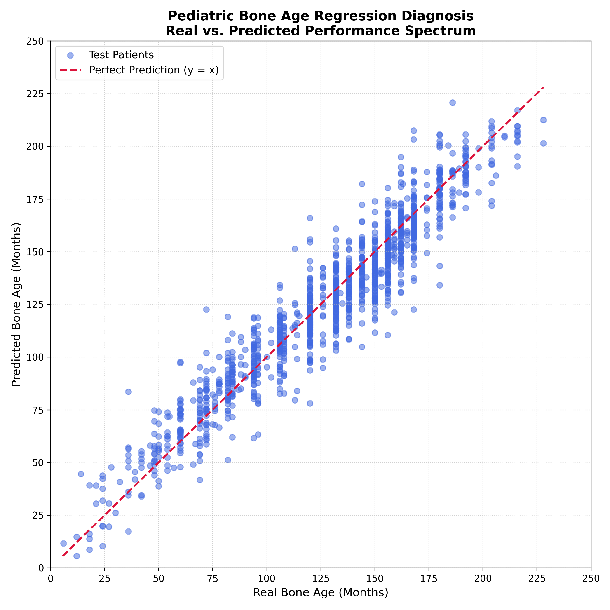

# 🦴 Pediatric Bone Age Estimation from Hand X-Rays
### Multi-Input Regression with Xception Transfer Learning | TensorFlow & Keras

---

## 📌 Overview

This project builds a deep learning **regression model** that estimates pediatric bone age (in months) from hand X-ray images. It uses a **Multi-Input Architecture** that combines:

- **Image branch:** Xception CNN (pretrained on ImageNet, fully fine-tuned) extracts visual features from the X-ray
- **Tabular branch:** A small Dense network encodes patient gender (0/1)
- **Fusion head:** Both branches are concatenated and passed through fully connected layers to predict bone age

The model also includes **Grad-CAM visualization** (`src/gradcam.py`) to highlight which bone regions the model focuses on when making predictions, plus a spatial-shift sanity check to verify the attention map is anatomically grounded rather than fixed in image-space.

---

## 📦 Dataset

**Source:** [RSNA Pediatric Bone Age Challenge — Kaggle](https://www.kaggle.com/datasets/kmader/rsna-bone-age)
**Task:** Continuous regression — predict bone age in **months**
**Format:** Grayscale PNG images, resized to 128×128 px (RGB for Xception compatibility)

| Split      | Size    |
|------------|---------|
| Train      | ~10,088 |
| Validation | ~1,261  |
| Test       | ~1,262  |

> **Note:** The original Kaggle test set has no labels. The test split used here is carved from the training CSV via an 80/10/10 split using `train_test_split`.

---

## 🏗️ Model Architecture

A **Functional API multi-input model** combining image and gender data:

```
Image Input (128, 128, 3)          Gender Input (1,)
        │                                  │
  Xception Base                      Dense(16, relu)
  (ImageNet weights,                       │
   fully fine-tuned)                       │
        │                                  │
GlobalAveragePooling2D (2048,)             │
        │                                  │
        └──────── Concatenate (2064,) ─────┘
                        │
                  Dense(32, relu)
                        │
               Dense(1, linear)  →  Predicted Bone Age (months)
```

| Detail               | Value                                       |
|----------------------|----------------------------------------------|
| Base Model           | Xception (ImageNet weights)                 |
| Fine-Tuning          | ✅ Full (`base_model.trainable = True`)     |
| Pooling              | **GlobalAveragePooling2D** *(updated — see note below)* |
| Gender Encoding      | Dense(16, relu)                             |
| Fusion               | Concatenate → Dense(32) → Dense(1)          |
| Output Activation    | Linear (regression)                         |
| Loss Function        | MSE                                         |
| Metrics              | MAE                                         |
| Total Parameters     | ~20.9M (79.83 MB)                           |

> **Note:** Switched from `GlobalMaxPooling2D` to `GlobalAveragePooling2D` — better suited for Grad-CAM.

### Why Multi-Input?
Gender is a clinically significant factor in bone development — bone maturation rates differ between males and females. Adding gender as a dedicated input branch (rather than ignoring it) gives the model direct access to this signal without forcing it to infer it from pixel data.

---

## ⚙️ Training Configuration

| Hyperparameter     | Value                                           |
|--------------------|--------------------------------------------------|
| Optimizer          | Adam (initial lr = 0.0001)                       |
| Loss Function      | MSE                                              |
| Max Epochs         | 30                                                |
| Batch Size         | 32                                                |
| Image Size         | 128×128                                           |
| EarlyStopping      | patience=8, monitors val_loss, restores best weights |
| ModelCheckpoint    | saves best val_loss only                          |
| ReduceLROnPlateau  | factor=0.5, patience=3, min_lr=1e-6 *(added)*     |

> **Why ReduceLROnPlateau?** Fixed LR plateaued at val MAE ≈ 12.75. Adding LR decay + more epochs improved it to **9.81 months**.

---

## 🩹 Preprocessing — Label/Marker Masking

Many X-rays contain a fixed-position laterality marker (L/R label). Left unmasked, the model could learn it as a shortcut instead of using true bone structure. `mask_image()` blacks out these markers via OpenCV contour detection before training.

---

## 🔄 Data Augmentation

Applied **only to training data** via `ImageDataGenerator`. Validation uses `preprocess_input` only (no augmentation).

| Technique          | Value         |
|---------------------|---------------|
| Rotation            | ±20°          |
| Height Shift        | 15%           |
| **Width Shift**     | **15%** *(added — original config only shifted vertically)* |
| Zoom                | 15%           |
| Horizontal Flip     | ✅ Enabled    |
| Preprocessing       | `preprocess_input` (normalizes to [−1, 1]) |

> No `rescale=1/255` — `preprocess_input` already normalizes pixels.

---

## 📊 Results

### Final Training Metrics (Epoch 29-30)

| Metric         | Value         |
|----------------|---------------|
| Train MAE      | 8.68 months   |
| **Best Val MAE** | **9.81 months** |
| Baseline MAE   | 13.00 months  |
| Improvement    | **3.19 months** over baseline ✅ |

### Bias Diagnosis Report (Test Set, n=1262)

| Segment                          | Bias         | n    |
|------------------------------------|--------------|------|
| Global                              | **-1.44 months** | 1262 |
| Children (< 72 months)              | +6.21 months | 140  |
| Mid-Range (72–156 months)           | -1.83 months | 803  |
| Adolescents & Older (> 156 months)  | -3.82 months | 319  |

> Earlier checkpoint had a global bias of -6.60 months. Remaining weak spot: early-childhood segment (small sample size, n=140).

### Real vs. Predicted Scatter Plot

The model tracks the y = x reference line closely across the 50–175 month range, with mild systematic deviation at the extreme ends of the age distribution — a typical "regression to the mean" pattern in continuous regression tasks.



---

## 🔥 Grad-CAM Visualization & Debugging Journey

The project includes a Grad-CAM module (`src/gradcam.py`) that overlays attention heatmaps on X-ray images, plus a `shift_image()` sanity check that artificially displaces the X-ray to verify the heatmap moves correctly with the anatomy rather than staying fixed in image-space.

**A real issue encountered during development:** early Grad-CAM outputs consistently highlighted a fixed region regardless of the actual bone structure. Three fixes resolved this:

1. `GlobalMaxPooling2D` → `GlobalAveragePooling2D` (avoided gradient collapse onto single artifact pixels)
2. Masked laterality markers (removed a spatial shortcut)
3. Switched the visualized layer from `block14_sepconv2_act` (4×4, blurry) to `block13_sepconv2_act` (8×8, sharper) — no retraining needed

```python
last_conv_layer = "block13_sepconv2_act"  # 8×8 — sharper than block14 (4×4)
```

After these fixes, Grad-CAM consistently localizes on **carpal bones and metacarpal growth plates** — anatomically consistent with radiological bone age assessment.

---

## 🗂️ Project Structure

```
📦 Pediatric-Bone-Age-Prediction-Xception/
├── src/
│   ├── main.py                    # Training pipeline entry point
│   ├── models_architecture.py     # Multi-input Xception model definition
│   ├── dataset.py                 # Data loading, masking, preprocessing, generators
│   ├── evaluation.py              # Test-set evaluation + bias diagnosis report
│   ├── gradcam.py                 # Grad-CAM heatmap visualization + spatial-shift sanity check
│   └── models/
│       └── best_xception_multi_input.h5  # Best checkpoint (gitignored — not tracked)
├── bonage_dataset/                # gitignored — download separately from Kaggle
│   ├── boneage-training-dataset/
│   ├── boneage-training-dataset.csv
│   └── df_test_split.csv          # Auto-generated test split after training
├── outputs/
│   ├── real_vs_pred_scatter.png
│   └── gradcam_results/
├── requirements.txt
├── .gitignore
└── README.md
```

---

## 🚀 Setup & Usage

### Requirements

```bash
pip install tensorflow keras scikit-learn pandas numpy matplotlib pillow opencv-python
```

### Dataset Setup

After downloading from Kaggle, ensure PNG files sit **directly** inside their dataset folders:

```
bonage_dataset/
├── boneage-training-dataset/
│   ├── 1377.png
│   └── ...
└── boneage-training-dataset.csv
```

### Train

```bash
python -m src.main
```

Prints a **Baseline Comparison Report** at the end, comparing the multi-input model's best val MAE against the 13.0-month single-input baseline.

### Evaluate

```bash
python -m src.evaluation
```

Generates the real-vs-predicted scatter plot and the age-segmented bias diagnosis report on the held-out test split.

### Grad-CAM Inference

```bash
python -m src.gradcam
```

Randomly selects a test sample, displays the original X-ray alongside its Grad-CAM attention map, and runs a spatial-shift sanity check to confirm the heatmap is anatomically grounded rather than fixed in image-space.

---

## ⚠️ Known Limitations

- **Image resolution trade-off** — 128×128 was used to reduce training time. Upscaling to 224×224 would also increase the Grad-CAM feature-map resolution (currently 8×8 at `block13`) and may further improve accuracy.
- **Early-childhood bias** — the model still overpredicts in the <72 month segment, likely due to limited sample size in that range.
- **Minimal fusion head** — `Dense(32) → Dense(1)`. A larger head may better map the 2064-dim fused representation to continuous bone age values.

## 🛠️ Tech Stack


---

> **Disclaimer:** This project is for educational purposes only and is not intended for clinical use.